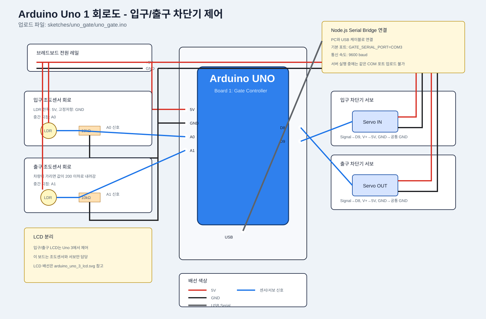

# 🚗 Smart Parking System

Wemos D1 R1 기반의 스마트 주차장 프로젝트입니다.  
입구에서는 **조도센서**로 차량 접근을 감지하고, 내부 주차칸은 **초음파센서 2개**로 점유 상태를 확인합니다. 빈자리가 있으면 차단기를 열고, 만차이면 LCD와 경고 장치로 진입을 막습니다. 주차 시간과 요금 계산은 별도의 **Node.js Express 요금 서버**가 담당합니다.

---

## 🧠 현재 보드 구성

현재 보유한 보드 수를 기준으로 기능을 나눴습니다.

| 보드 | 업로드할 스케치 | 담당 역할 |
| --- | --- | --- |
| Arduino Uno 1 | `sketches/uno_gate/uno_gate.ino` | 입구/출구 조도센서, 입구/출구 차단기, LCD, 만차 경고 |
| Arduino Uno 2 | `sketches/uno_slots/uno_slots.ino` | 주차칸 2개 초음파센서, 칸별 빨간/초록 LED |
| Wemos D1 R1 1 | `sketches/wemos_gateway/wemos_gateway.ino` | Uno 보드 이벤트 수신, 요금 서버 GET 요청, 요금 응답 중계 |
| Wemos D1 R1 2 | `sketches/wemos_monitor/wemos_monitor.ino` | 요금 서버 상태 확인용 보조 모니터 |

루트 폴더에는 통합 실행용 `.ino` 파일을 두지 않습니다. 실제 업로드 대상은 `sketches/` 아래의 보드별 `.ino` 파일이며, 루트의 `BOARD_UPLOAD_GUIDE.md`는 어떤 파일을 어느 보드에 업로드해야 하는지 안내합니다.

---

## 🔁 보드 간 통신 구조

```text
Arduino Uno 2: 주차칸 감지
  └─ ENTRY,1 / VACATED,1 같은 문자열 전송
      ↓ SoftwareSerial
Wemos D1 R1 1: 요금 게이트웨이
  ├─ /parking/entry?slot=1 요청
  ├─ 출차 대기 슬롯 저장
  └─ 차단기 통과 이벤트 수신 시 /parking/exit?slot=1 요청
      ↓ SoftwareSerial
Arduino Uno 1: 입구/출구 차단기/LCD
  ├─ EMPTY,n 수신 후 입차 가능 여부 판단
  ├─ 입구 차량 감지 시 입구 차단기 제어
  ├─ 출구 차량 감지 시 BARRIER_EXIT 전송
  └─ FEE,slot,fee 수신 후 LCD에 요금 표시
```

핵심은 **Uno는 센서와 장치 제어**, **Wemos는 Wi-Fi와 서버 통신**을 맡는 구조입니다.

---

## ✨ 핵심 기능

| 기능 | 설명 |
| --- | --- |
| 🚦 입구/출구 차량 감지 | 조도센서 2개로 입차 차량과 출차 차량을 각각 감지 |
| 🅿️ 주차칸 상태 확인 | 초음파센서 2개로 1번/2번 주차칸 점유 여부 판단 |
| 📟 LCD 안내 | `Entrance Open`, `Parking Full`, 출차 요금 표시 |
| 🚧 차단기 제어 | 입구 차단기와 출구 차단기를 각각 서보모터로 제어 |
| 🔴🟢 칸별 LED | 차량 있음: 빨간 LED, 빈자리: 초록 LED |
| 🧾 요금 계산 | 입차/출차 시간을 서버에 기록하고 주차 요금 계산 |
| 🌐 서버 연동 | Wemos가 Express 서버에 GET 요청 전송 |

---

## 🧭 전체 동작 흐름

```text
┌──────────────────────┐
│ 1. 입구 조도센서 감지 │
└──────────┬───────────┘
           │
           v
┌────────────────────────────┐
│ 2. 주차칸 2개 초음파 확인   │
└──────────┬─────────────────┘
           │
           v
┌────────────────────────────┐
│ 3. 빈자리 개수 계산         │
└───────┬─────────────┬──────┘
        │             │
        v             v
  빈자리 있음       만차
        │             │
        v             v
┌──────────────┐  ┌────────────────┐
│LCD Entrance  │  │ LCD Parking Full│
│Open          │  │                  │
│ 차단기 열림  │  │ LED/부저 경고   │
└──────┬───────┘  │ 차단기 닫힘     │
       │          └────────────────┘
       v
┌────────────────────────────┐
│ 4. 차량이 주차칸에 들어감   │
└──────────┬─────────────────┘
           v
┌────────────────────────────┐
│ 5. 입차 시간 서버 등록      │
└──────────┬─────────────────┘
           v
┌────────────────────────────┐
│ 6. 주차칸에서 차량 이탈     │
└──────────┬─────────────────┘
           v
┌────────────────────────────┐
│ 7. 출차 대기 상태 저장      │
└──────────┬─────────────────┘
           v
┌────────────────────────────┐
│ 8. 차단기 통과 2차 감지     │
└──────────┬─────────────────┘
           v
┌────────────────────────────┐
│ 9. 출차 요청 + 요금 계산    │
└──────────┬─────────────────┘
           v
┌────────────────────────────┐
│ 10. LCD에 요금 표시         │
└────────────────────────────┘
```

---

## 🛣️ 시나리오별 동작

### ✅ 입차 가능

```text
입구 차량 감지
→ 주차칸 2개 상태 확인
→ 빈자리 1개 이상
→ LCD: Entrance Open
→ 만차 경고 OFF
→ 서보모터 90도 회전
→ 차단기 열림
```

### ⛔ 만차

```text
입구 차량 감지
→ 주차칸 2개 모두 점유
→ LCD: Parking Full
→ 빨간 LED 또는 부저 경고 ON
→ 서보모터 0도 유지
→ 차단기 닫힘
```

### 🧾 입차 등록

```text
차량이 특정 주차칸에 들어옴
→ 해당 칸 초음파센서가 차량 감지
→ 해당 칸 빨간 LED ON
→ 요금 서버에 GET /parking/entry?slot=칸번호 요청
→ 서버가 입차 시간 저장
```

### 💳 2단계 출차 정산

```text
1차 감지: 주차칸에서 차량이 빠짐
→ 해당 칸을 출차 대기 상태로 저장
→ 해당 칸 초록 LED ON

2차 감지: 차량이 차단기를 통과함
→ 요금 서버에 GET /parking/exit?slot=칸번호 요청
→ 서버가 주차 시간과 요금 계산
→ Wemos가 response에서 fee 값 추출
→ LCD에 요금 표시
```

출차를 2단계로 나눈 이유는 주차칸에서 잠깐 센서가 흔들리는 상황을 바로 출차로 처리하지 않기 위해서입니다. 실제 차량이 차단기까지 통과했을 때 출차를 확정합니다.

---

## 📁 파일 구조

```text
led/
├── BOARD_UPLOAD_GUIDE.md
├── sketches/
│   ├── uno_gate/
│   │   └── uno_gate.ino
│   ├── uno_slots/
│   │   └── uno_slots.ino
│   ├── wemos_gateway/
│   │   └── wemos_gateway.ino
│   └── wemos_monitor/
│       └── wemos_monitor.ino
├── 차단기/
│   ├── barrier.h
│   └── entrance_sensor.h
├── 주차칸/
│   ├── parking_slots.h
│   ├── parking_display.h
│   └── parking_alert.h
├── 요금/
│   ├── fee_request.h
│   └── fee-server/
│       ├── package.json
│       ├── package-lock.json
│       ├── .gitignore
│       └── src/
│           ├── feeCalculator.js
│           └── server.js
└── README.md
```

| 파일 | 담당 기능 |
| --- | --- |
| `BOARD_UPLOAD_GUIDE.md` | 보드별 업로드 대상 안내 |
| `sketches/uno_gate/uno_gate.ino` | 입구/출구 조도센서, 입구/출구 차단기, LCD, 만차 경고 제어 |
| `sketches/uno_slots/uno_slots.ino` | 주차칸 감지와 칸별 LED 제어 |
| `sketches/wemos_gateway/wemos_gateway.ino` | Uno 이벤트와 요금 서버 사이의 게이트웨이 |
| `sketches/wemos_monitor/wemos_monitor.ino` | 요금 서버 상태 확인용 보조 모니터 |
| `차단기/entrance_sensor.h` | 입구 조도센서 감지, 차단기 통과 감지 함수 제공 |
| `차단기/barrier.h` | 서보모터 기반 차단기 열림/닫힘 |
| `주차칸/parking_slots.h` | 주차칸 2개 상태 확인, 칸별 LED 제어, 입차/출차 대기 처리 |
| `주차칸/parking_display.h` | I2C LCD 메시지 출력 |
| `주차칸/parking_alert.h` | 만차 경고 LED/부저 제어 |
| `요금/fee_request.h` | Wemos에서 요금 서버로 HTTP GET 요청 전송 |
| `요금/fee-server/src/server.js` | Express API 서버 |
| `요금/fee-server/src/feeCalculator.js` | 주차 요금 계산 로직 |

---

## 🔌 기본 핀 설정

> 실제 배선에 따라 헤더 파일 상단의 상수 값을 수정하면 됩니다.

| 장치 | 핀 | 위치 |
| --- | --- | --- |
| 입구 조도센서 | `A0` | `sketches/uno_gate/uno_gate.ino` |
| 출구 조도센서 | `A1` | `sketches/uno_gate/uno_gate.ino` |
| 입구 차단기 서보모터 | `9` | `sketches/uno_gate/uno_gate.ino` |
| 출구 차단기 서보모터 | `10` | `sketches/uno_gate/uno_gate.ino` |
| 만차 경고 LED | `12` | `sketches/uno_gate/uno_gate.ino` |
| 만차 경고 부저 | `11` | `sketches/uno_gate/uno_gate.ino` |
| 1번 칸 초음파 TRIG | `D6` | `주차칸/parking_slots.h` |
| 1번 칸 초음파 ECHO | `D3` | `주차칸/parking_slots.h` |
| 2번 칸 초음파 TRIG | `D7` | `주차칸/parking_slots.h` |
| 2번 칸 초음파 ECHO | `D4` | `주차칸/parking_slots.h` |
| 1번 칸 빨간 LED | `D9` | `주차칸/parking_slots.h` |
| 1번 칸 초록 LED | `D10` | `주차칸/parking_slots.h` |
| 2번 칸 빨간 LED | `D11` | `주차칸/parking_slots.h` |
| 2번 칸 초록 LED | `D12` | `주차칸/parking_slots.h` |
| I2C LCD | SDA / SCL | `주차칸/parking_display.h` |

---

## 🖼️ 회로도

### Arduino Uno 1: 입구/출구 차단기 제어

아래 회로도는 `sketches/uno_gate/uno_gate.ino` 기준입니다.



포함된 연결:

- 입구 조도센서: `A0`
- 출구 조도센서: `A1`
- 입구 차단기 서보모터: `D9`
- 출구 차단기 서보모터: `D10`
- 만차 경고 부저: `D11`
- 만차 경고 LED: `D12`
- I2C LCD: `A4(SDA)`, `A5(SCL)`
- Wemos Gateway 통신: `D2`, `D3`

---

## 🧰 사용 재료

### 필수 부품

| 분류 | 부품 | 개수 | 용도 |
| --- | --- | ---: | --- |
| 보드 | Wemos D1 R1 | 1개 | 센서 입력, LED/LCD/서보 제어, 요금 서버 통신 |
| 회로 구성 | 브레드보드 | 1개 이상 | 센서와 LED 회로 구성 |
| 배선 | 점퍼 와이어 | 충분히 | 보드, 센서, LED, LCD, 부저 연결 |
| 입출구 감지 | 조도센서 | 2개 | 입구 차량과 출구 차량 감지 |
| 입출구 감지 | 조도센서용 저항 | 2개 | 조도센서 분압 회로 구성 |
| 주차칸 감지 | HC-SR04 초음파센서 | 2개 | 1번/2번 주차칸 차량 점유 확인 |
| 표시 장치 | I2C LCD 16x2 | 1개 | Entrance Open, Parking Full, 요금 표시 |
| 차단기 | 서보모터 | 2개 | 입구/출구 차단기 열림/닫힘 제어 |
| 차단기 | 차단기 막대 재료 | 2개 | 실제 차단기 팔 역할 |
| 주차칸 LED | 빨간색 LED | 2개 | 각 주차칸 차량 점유 표시 |
| 주차칸 LED | 초록색 LED | 2개 | 각 주차칸 빈자리 표시 |
| 만차 경고 | 빨간색 LED | 1개 | 만차 경고 표시 |
| 만차 경고 | 부저 | 1개 | 만차 경고음 출력 |
| LED 보호 | LED용 저항 | 5개 이상 | LED 전류 제한 |
| 전압 보호 | 전압 분배용 저항 | 4개 이상 | HC-SR04 ECHO 5V 신호를 ESP8266 입력에 맞춤 |
| 서버 | Node.js 실행 PC | 1대 | Express 요금 계산 서버 실행 |

### 선택 부품

| 부품 | 개수 | 용도 |
| --- | ---: | --- |
| 추가 조도센서 또는 적외선 센서 | 1개 | 차단기 통과 전용 감지 센서로 사용 |
| 외부 5V 전원 | 1개 | 서보모터와 센서 전류가 부족할 때 사용 |
| 주차장 모형 재료 | 필요량 | 발표용 주차장 구조 제작 |
| 차량 모형 | 1~2개 | 센서 테스트 및 시연 |

> 현재 코드는 차단기 통과 감지를 입구 조도센서 값으로 재사용합니다. 더 안정적인 출차 정산을 원하면 차단기 전용 센서를 추가하는 구성이 좋습니다.

---

## ⚙️ 주요 설정값

### 입구/출구 조도센서 기준

```cpp
const int LIGHT_BLOCKED_THRESHOLD = 350;
```

평상시 조도 값이 `400~500`대이고 차량이 센서를 가리면 `300` 이하로 내려가는 상황을 기준으로 잡았습니다. 조도 값이 `350` 이하이면 차량이 감지된 것으로 판단합니다.

### 주차칸 차량 감지 거리

```cpp
const int SLOT_OCCUPIED_DISTANCE_CM = 5;
```

초음파센서가 `5cm` 이하를 감지하면 해당 주차칸을 점유 상태로 봅니다.

### 차단기 각도

```cpp
const int BARRIER_CLOSED_ANGLE = 0;
const int BARRIER_OPEN_ANGLE = 90;
```

빈자리가 있으면 `90도`, 만차 또는 대기 상태에서는 `0도`로 제어합니다.

### 요금 서버 주소

```cpp
const char FEE_SERVER_BASE_URL[] = "http://192.168.0.10:3000";
```

Wemos에서 접근할 수 있도록 서버 PC의 내부 IP 주소로 바꿔야 합니다.

---

## 🌐 요금 서버 API

| Method | URL | 설명 |
| --- | --- | --- |
| GET | `/parking/entry?slot=1` | 1번 칸 입차 시간 저장 |
| GET | `/parking/entry?slot=2` | 2번 칸 입차 시간 저장 |
| GET | `/parking/exit?slot=1` | 1번 칸 출차 요금 계산 |
| GET | `/parking/exit?slot=2` | 2번 칸 출차 요금 계산 |
| GET | `/parking/sessions` | 현재 주차 중인 차량 목록 확인 |

출차 응답 예시:

```json
{
  "ok": true,
  "receipt": {
    "slotId": "1",
    "enteredAt": "2026-06-11T00:51:57.599Z",
    "exitedAt": "2026-06-11T01:25:57.686Z",
    "parkedMinutes": 34,
    "fee": 1500
  }
}
```

---

## 💰 요금 정책

| 구간 | 요금 |
| --- | --- |
| 기본 30분 | `1000원` |
| 이후 10분마다 | `500원` 추가 |

예시:

| 주차 시간 | 계산 요금 |
| --- | --- |
| 1분 | `1000원` |
| 30분 | `1000원` |
| 31분 | `1500원` |
| 45분 | `2000원` |

---

## ▶️ 실행 방법

### 1. 요금 서버 실행

```bash
cd 요금/fee-server
npm install
npm start
```

서버 기본 주소:

```text
http://localhost:3000
```

Wemos 코드에서는 `localhost`가 아니라 서버 PC의 내부 IP를 사용해야 합니다.

### 2. Wemos 설정

`요금/fee_request.h`에서 Wi-Fi와 서버 주소를 수정합니다.

```cpp
const char WIFI_SSID[] = "YOUR_WIFI_SSID";
const char WIFI_PASSWORD[] = "YOUR_WIFI_PASSWORD";
const char FEE_SERVER_BASE_URL[] = "http://192.168.0.10:3000";
```

### 3. Arduino 업로드

보드별로 아래 스케치를 각각 업로드합니다.

| 보드 | Arduino IDE 보드 선택 | 업로드 파일 |
| --- | --- | --- |
| Arduino Uno 1 | Arduino Uno | `sketches/uno_gate/uno_gate.ino` |
| Arduino Uno 2 | Arduino Uno | `sketches/uno_slots/uno_slots.ino` |
| Wemos D1 R1 1 | LOLIN(WeMos) D1 R1 | `sketches/wemos_gateway/wemos_gateway.ino` |
| Wemos D1 R1 2 | LOLIN(WeMos) D1 R1 | `sketches/wemos_monitor/wemos_monitor.ino` |

---

## 📟 LCD 표시 상태

| 상황 | LCD 1행 | LCD 2행 |
| --- | --- | --- |
| 입차 가능 | `Entrance Open` | `Empty: 빈자리수` |
| 만차 | `Parking Full` | `Gate Closed` |
| 출차 감지 | `Exit Open` | `Calculating...` |
| 출차 요금 표시 | `Slot n Exit` | `Fee: 요금` |

---

## ⚠️ 하드웨어 주의사항

- Wemos D1 R1의 실제 사용 가능 핀은 보드 패키지와 보드 종류에 따라 다를 수 있습니다.
- `D9`, `D10`, `D11`, `D12`는 환경에 따라 바로 인식되지 않을 수 있어 실제 보드 핀맵 확인이 필요합니다.
- HC-SR04의 ECHO는 보통 5V로 출력되므로 ESP8266 입력에는 전압 분배 회로를 사용하는 것이 안전합니다.
- I2C LCD 주소가 `0x27`이 아니면 `주차칸/parking_display.h`의 `LCD_ADDRESS` 값을 바꿔야 합니다.
- 입구와 출구는 조도센서를 각각 1개씩 사용합니다. 평상시 값과 차량 통과 시 값을 시리얼 모니터로 확인한 뒤 `LIGHT_BLOCKED_THRESHOLD`를 조정하면 됩니다.
- 현재 폴더명은 가독성을 위해 한글(`차단기`, `주차칸`, `요금`)로 정리되어 있습니다. 일부 Arduino CLI/ESP8266 빌드 환경에서는 한글 include 경로가 깨질 수 있으므로, 컴파일 오류가 나면 폴더명을 ASCII로 되돌려야 합니다.

---

## ✅ 구현 현황

- ✅ 입구 조도센서 감지 구조
- ✅ 주차칸 2개 초음파 감지 구조
- ✅ 칸별 빨간/초록 LED 표시
- ✅ LCD 상태 표시
- ✅ 서보모터 차단기 제어
- ✅ 만차 경고 LED/부저 제어
- ✅ 입차 서버 등록
- ✅ 2단계 출차 확정 로직
- ✅ 출차 요금 계산 및 LCD 표시
- ✅ Node.js Express 요금 서버

---

## 🧪 검증 상태

- Node.js 서버 문법 확인 완료
- Express 서버 GET 요청 테스트 완료
- `sketches/uno_gate` Arduino Uno 컴파일 완료
- `sketches/uno_slots` Arduino Uno 컴파일 완료
- `sketches/wemos_gateway` Wemos D1 R1 컴파일 완료
- `sketches/wemos_monitor` Wemos D1 R1 컴파일 완료
- 한글 폴더명을 include하는 기존 통합 구조는 ESP8266 빌드 과정의 경로 인코딩 문제로 실패 확인
