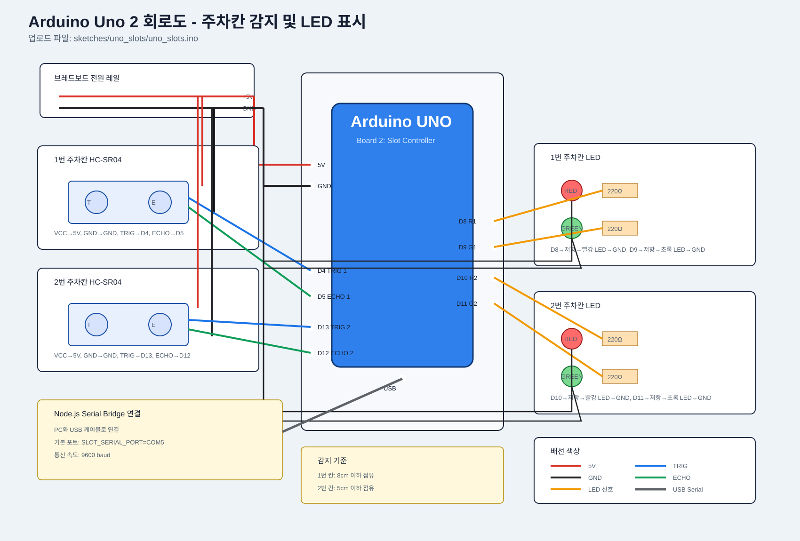
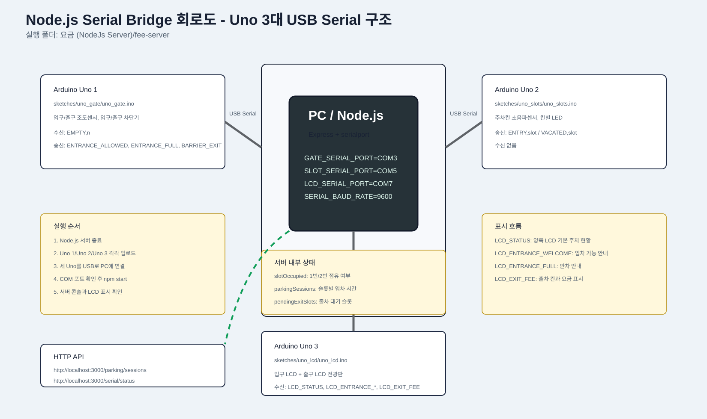

# 🚗 Smart Parking System

Arduino Uno 2대와 Node.js Serial Bridge를 사용하는 스마트 주차장 프로젝트입니다.  
입구에서는 **조도센서**로 차량 접근을 감지하고, 내부 주차칸은 **초음파센서 2개**로 점유 상태를 확인합니다. 빈자리가 있으면 차단기를 열고, 만차이면 LCD에 `Parking Full`을 표시한 뒤 차단기를 닫힌 상태로 유지합니다. 주차 시간과 요금 계산은 별도의 **Node.js Express 요금 서버**가 담당합니다.

---

## 🧠 현재 보드 구성

현재 보유한 보드 수를 기준으로 기능을 나눴습니다.

| 구성 요소 | 실행/업로드 대상 | 담당 역할 |
| --- | --- | --- |
| Arduino Uno 1 | `sketches/uno_gate/uno_gate.ino` | 입구/출구 조도센서, 입구/출구 차단기, LCD |
| Arduino Uno 2 | `sketches/uno_slots/uno_slots.ino` | 주차칸 2개 초음파센서, 칸별 빨간/초록 LED |
| PC Node.js 서버 | `요금 (NodeJs Server)/fee-server/src/server.js` | Uno 2개 USB Serial 중계, 슬롯 상태 저장, 요금 계산 |

루트 폴더에는 통합 실행용 `.ino` 파일을 두지 않습니다. 실제 업로드 대상은 `sketches/` 아래의 보드별 `.ino` 파일이며, 루트의 `BOARD_UPLOAD_GUIDE.md`는 어떤 파일을 어느 보드에 업로드해야 하는지 안내합니다.

---

## 🔁 보드 간 통신 구조

```text
Arduino Uno 2: 주차칸 감지
  └─ ENTRY,1 / VACATED,1 같은 문자열 전송
      ↓ USB Serial
Node.js 서버: Serial Bridge + 요금 계산
  ├─ 슬롯별 입차 시간 저장
  ├─ 빈자리 수 계산 후 EMPTY,n 전송
  ├─ 출차 대기 슬롯 저장
  └─ BARRIER_EXIT 수신 시 요금 계산
      ↓ USB Serial
Arduino Uno 1: 입구/출구 차단기/LCD
  ├─ EMPTY,n 수신 후 입차 가능 여부 판단
  ├─ 입구 차량 감지 시 입구 차단기 제어
  ├─ 출구 차량 감지 시 BARRIER_EXIT 전송
  └─ FEE,slot,fee 수신 후 LCD에 요금 표시
```

핵심은 **Uno는 센서와 장치 제어**, **Node.js는 두 Uno의 USB Serial 중계와 요금 계산**을 맡는 구조입니다.

---

## ✨ 핵심 기능

| 기능 | 설명 |
| --- | --- |
| 🚦 입구/출구 차량 감지 | 조도센서 2개로 입차 차량과 출차 차량을 각각 감지 |
| 🅿️ 주차칸 상태 확인 | 초음파센서 2개로 1번/2번 주차칸 점유 여부 판단 |
| 📟 LCD 안내 | `Entrance Open`, `Parking Full`, 출차 요금 표시 |
| 🚧 차단기 제어 | 입구 차단기와 출구 차단기를 각각 서보모터로 제어 |
| 🔴🟢 칸별 LED | 차량 있음: 빨간 LED, 빈자리: 초록 LED |
| 🧾 요금 계산 | 입차/출차 시간을 서버에 기록하고 주차 요금 계산 |
| 🔌 서버 연동 | Node.js가 Uno 2개와 USB Serial로 직접 통신 |

---

## 🧭 전체 동작 흐름

```text
┌──────────────────────┐
│ 1. 입구 조도센서 감지 │
└──────────┬───────────┘
           │
           v
┌────────────────────────────┐
│ 2. 주차칸 2개 초음파 확인   │
└──────────┬─────────────────┘
           │
           v
┌────────────────────────────┐
│ 3. 빈자리 개수 계산         │
└───────┬─────────────┬──────┘
        │             │
        v             v
  빈자리 있음       만차
        │             │
        v             v
┌──────────────┐  ┌────────────────┐
│LCD Entrance  │  │ LCD Parking Full│
│Open          │  │                  │
│ 차단기 열림  │  │ 차단기 닫힘 유지│
└──────┬───────┘  │ 차단기 닫힘     │
       │          └────────────────┘
       v
┌────────────────────────────┐
│ 4. 차량이 주차칸에 들어감   │
└──────────┬─────────────────┘
           v
┌────────────────────────────┐
│ 5. 입차 시간 서버 등록      │
└──────────┬─────────────────┘
           v
┌────────────────────────────┐
│ 6. 주차칸에서 차량 이탈     │
└──────────┬─────────────────┘
           v
┌────────────────────────────┐
│ 7. 출차 대기 상태 저장      │
└──────────┬─────────────────┘
           v
┌────────────────────────────┐
│ 8. 차단기 통과 2차 감지     │
└──────────┬─────────────────┘
           v
┌────────────────────────────┐
│ 9. 출차 요청 + 요금 계산    │
└──────────┬─────────────────┘
           v
┌────────────────────────────┐
│ 10. LCD에 요금 표시         │
└────────────────────────────┘
```

---

## 🛣️ 시나리오별 동작

### ✅ 입차 가능

```text
입구 차량 감지
→ 주차칸 2개 상태 확인
→ 빈자리 1개 이상
→ LCD: Entrance Open
→ 서보모터를 정해진 시간 동안 회전
→ 차단기 열림
```

### ⛔ 만차

```text
입구 차량 감지
→ 주차칸 2개 모두 점유
→ LCD: Parking Full
→ 서보모터 정지 상태 유지
→ 차단기 닫힘
```

### 🧾 입차 등록

```text
차량이 특정 주차칸에 들어옴
→ 해당 칸 초음파센서가 차량 감지
→ 해당 칸 빨간 LED ON
→ Uno 2가 Node.js에 ENTRY,칸번호 전송
→ 서버가 입차 시간 저장
```

### 💳 2단계 출차 정산

```text
1차 감지: 주차칸에서 차량이 빠짐
→ 해당 칸을 출차 대기 상태로 저장
→ 해당 칸 초록 LED ON

2차 감지: 차량이 차단기를 통과함
→ Uno 1이 Node.js에 BARRIER_EXIT 전송
→ Node.js가 출차 대기 슬롯의 주차 시간과 요금 계산
→ Node.js가 Uno 1에 FEE,slot,fee 전송
→ LCD에 요금 표시
```

출차를 2단계로 나눈 이유는 주차칸에서 잠깐 센서가 흔들리는 상황을 바로 출차로 처리하지 않기 위해서입니다. 실제 차량이 차단기까지 통과했을 때 출차를 확정합니다.

---

## 📁 파일 구조

```text
led/
├── BOARD_UPLOAD_GUIDE.md
├── sketches/
│   ├── uno_gate/
│   │   └── uno_gate.ino
│   ├── uno_slots/
│   │   └── uno_slots.ino
│   ├── test/
│   │   ├── uno_d8_servo_test/
│   │   ├── uno_gate_no_lcd_test/
│   │   ├── uno_gate_test/
│   │   ├── uno_i2c_scanner/
│   │   └── uno_slots_test/
├── docs/
│   └── circuits/
│       ├── arduino_uno_1_gate.svg
│       ├── arduino_uno_2_slots.svg
│       └── node_serial_bridge.svg
├── 차단기 (Uno 1)/
│   ├── barrier.h
│   └── entrance_sensor.h
├── 주차칸 (Uno 2)/
│   ├── parking_slots.h
│   ├── parking_display.h
│   └── parking_alert.h       # 이전 모듈화 구조 참고용
├── 요금 (NodeJs Server)/
│   └── fee-server/
│       ├── package.json
│       ├── package-lock.json
│       ├── .gitignore
│       └── src/
│           ├── feeCalculator.js
│           └── server.js
└── README.md
```

| 파일 | 담당 기능 |
| --- | --- |
| `BOARD_UPLOAD_GUIDE.md` | 보드별 업로드 대상 안내 |
| `sketches/uno_gate/uno_gate.ino` | 입구/출구 조도센서, 입구/출구 차단기, LCD 제어 |
| `sketches/uno_slots/uno_slots.ino` | 주차칸 감지와 칸별 LED 제어 |
| `docs/circuits/*.svg` | 보드별 회로도 |
| `sketches/test/*` | 센서, LCD, 서보 분리 테스트용 스케치 |
| `차단기 (Uno 1)/`, `주차칸 (Uno 2)/` | 기능별 모듈 참고용 헤더 |
| `요금 (NodeJs Server)/fee-server/src/server.js` | Express API 서버 |
| `요금 (NodeJs Server)/fee-server/src/feeCalculator.js` | 주차 요금 계산 로직 |

---

## 🔌 기본 핀 설정

> 실제 배선에 따라 헤더 파일 상단의 상수 값을 수정하면 됩니다.

| 장치 | 핀 | 위치 |
| --- | --- | --- |
| 입구 조도센서 | `A0` | `sketches/uno_gate/uno_gate.ino` |
| 출구 조도센서 | `A1` | `sketches/uno_gate/uno_gate.ino` |
| 입구 차단기 서보모터 | `D9` | `sketches/uno_gate/uno_gate.ino` |
| 출구 차단기 서보모터 | `D8` | `sketches/uno_gate/uno_gate.ino` |
| I2C LCD | `A4(SDA)`, `A5(SCL)` | `sketches/uno_gate/uno_gate.ino` |
| Uno 1 ↔ Node.js 서버 | USB Serial `9600 baud` | `sketches/uno_gate/uno_gate.ino` |
| 1번 칸 초음파 TRIG | `D4` | `sketches/uno_slots/uno_slots.ino` |
| 1번 칸 초음파 ECHO | `D5` | `sketches/uno_slots/uno_slots.ino` |
| 2번 칸 초음파 TRIG | `D13` | `sketches/uno_slots/uno_slots.ino` |
| 2번 칸 초음파 ECHO | `D12` | `sketches/uno_slots/uno_slots.ino` |
| 1번 칸 빨간 LED | `D8` | `sketches/uno_slots/uno_slots.ino` |
| 1번 칸 초록 LED | `D9` | `sketches/uno_slots/uno_slots.ino` |
| 2번 칸 빨간 LED | `D10` | `sketches/uno_slots/uno_slots.ino` |
| 2번 칸 초록 LED | `D11` | `sketches/uno_slots/uno_slots.ino` |
| Uno 2 ↔ Node.js 서버 | USB Serial `9600 baud` | `sketches/uno_slots/uno_slots.ino` |

---

## 🖼️ 회로도

### Arduino Uno 1: 입구/출구 차단기 제어

아래 회로도는 `sketches/uno_gate/uno_gate.ino` 기준입니다.


포함된 연결:

- 입구 조도센서: `A0`
- 출구 조도센서: `A1`
- 입구 차단기 서보모터: `D9`
- 출구 차단기 서보모터: `D8`
- I2C LCD: `A4(SDA)`, `A5(SCL)`
- Node.js Serial Bridge 통신: USB Serial `9600 baud`

### Arduino Uno 2: 주차칸 감지 및 LED 표시

아래 회로도는 `sketches/uno_slots/uno_slots.ino` 기준입니다.



포함된 연결:

- 1번 칸 초음파센서: `D4(TRIG)`, `D5(ECHO)`
- 2번 칸 초음파센서: `D13(TRIG)`, `D12(ECHO)`
- 1번 칸 LED: 빨강 `D8`, 초록 `D9`
- 2번 칸 LED: 빨강 `D10`, 초록 `D11`
- Node.js Serial Bridge 통신: USB Serial `9600 baud`

### Node.js Serial Bridge: 요금 서버와 보드 연결

아래 회로도는 `요금 (NodeJs Server)/fee-server/src/server.js` 기준입니다.



포함된 연결:

- Uno 1 USB Serial: `GATE_SERIAL_PORT`, 기본 `COM3`
- Uno 2 USB Serial: `SLOT_SERIAL_PORT`, 기본 `COM5`
- 통신 속도: `9600 baud`
- 서버 상태 확인: `http://localhost:3000/serial/status`
- 주차 세션 확인: `http://localhost:3000/parking/sessions`

현재 시연용 메인 흐름은 Arduino Uno 2대와 PC Node.js 서버만 사용합니다.

---

## 🧰 사용 재료

### 필수 부품

| 분류 | 부품 | 개수 | 용도 |
| --- | --- | ---: | --- |
| 보드 | Arduino Uno | 2개 | 차단기 제어, 주차칸 감지 |
| 서버 | Node.js 실행 PC | 1대 | USB Serial 중계와 요금 계산 서버 실행 |
| 회로 구성 | 브레드보드 | 1개 이상 | 센서와 LED 회로 구성 |
| 배선 | 점퍼 와이어 | 충분히 | 보드, 센서, LED, LCD, 서보 연결 |
| 입출구 감지 | 조도센서 | 2개 | 입구 차량과 출구 차량 감지 |
| 입출구 감지 | 조도센서용 저항 | 2개 | 조도센서 분압 회로 구성 |
| 주차칸 감지 | HC-SR04 초음파센서 | 2개 | 1번/2번 주차칸 차량 점유 확인 |
| 표시 장치 | I2C LCD 16x2 | 1개 | Entrance Open, Parking Full, 요금 표시 |
| 차단기 | 서보모터 | 2개 | 입구/출구 차단기 열림/닫힘 제어 |
| 차단기 | 차단기 막대 재료 | 2개 | 실제 차단기 팔 역할 |
| 주차칸 LED | 빨간색 LED | 2개 | 각 주차칸 차량 점유 표시 |
| 주차칸 LED | 초록색 LED | 2개 | 각 주차칸 빈자리 표시 |
| LED 보호 | LED용 저항 | 4개 이상 | LED 전류 제한 |

### 선택 부품

| 부품 | 개수 | 용도 |
| --- | ---: | --- |
| 추가 조도센서 또는 적외선 센서 | 1개 | 차단기 통과 전용 감지 센서로 사용 |
| 외부 5V 전원 | 1개 | 서보모터와 센서 전류가 부족할 때 사용 |
| 주차장 모형 재료 | 필요량 | 발표용 주차장 구조 제작 |
| 차량 모형 | 1~2개 | 센서 테스트 및 시연 |

> 현재 코드는 차단기 통과 감지를 입구 조도센서 값으로 재사용합니다. 더 안정적인 출차 정산을 원하면 차단기 전용 센서를 추가하는 구성이 좋습니다.

---

## ⚙️ 주요 설정값

### 입구/출구 조도센서 기준

```cpp
const int LIGHT_BLOCKED_THRESHOLD = 200;
```

평상시 조도 값이 `400~500`대이고 차량이 센서를 가리면 `300` 이하로 내려가는 상황을 기준으로 잡았습니다. 현재는 조도 값이 `200` 이하이면 차량이 감지된 것으로 판단합니다.

### 주차칸 차량 감지 거리

```cpp
const int SLOT_OCCUPIED_DISTANCE_CM[SLOT_COUNT] = {8, 5};
```

1번 칸 초음파센서는 `8cm` 이하, 2번 칸 초음파센서는 `5cm` 이하를 감지하면 해당 주차칸을 점유 상태로 봅니다.

### 차단기 서보 신호

```cpp
const int SERVO_STOP_ANGLE = 90;
const int SERVO_OPEN_ROTATE_ANGLE = 180;
const int SERVO_CLOSE_ROTATE_ANGLE = 0;
```

연속회전형 서보 기준입니다. `90`은 정지, `180`과 `0`은 양방향 회전 신호로 사용합니다.

### Serial Bridge 포트

```bash
set GATE_SERIAL_PORT=COM3
set SLOT_SERIAL_PORT=COM5
set SERIAL_BAUD_RATE=9600
```

Node.js 서버가 Uno 1과 Uno 2 USB 포트를 직접 엽니다. 포트 번호는 PC 환경에 맞게 바꿔야 합니다.

---

## 🌐 요금 서버 API

| Method | URL | 설명 |
| --- | --- | --- |
| GET | `/parking/entry?slot=1` | 1번 칸 입차 시간 저장 |
| GET | `/parking/entry?slot=2` | 2번 칸 입차 시간 저장 |
| GET | `/parking/exit?slot=1` | 1번 칸 출차 요금 계산 |
| GET | `/parking/exit?slot=2` | 2번 칸 출차 요금 계산 |
| GET | `/parking/sessions` | 현재 주차 중인 차량 목록 확인 |

출차 응답 예시:

```json
{
  "ok": true,
  "receipt": {
    "slotId": "1",
    "enteredAt": "2026-06-11T00:51:57.599Z",
    "exitedAt": "2026-06-11T01:25:57.686Z",
    "parkedMinutes": 34,
    "fee": 1500
  }
}
```

---

## 💰 요금 정책

| 구간 | 요금 |
| --- | --- |
| 기본 30분 | `1000원` |
| 이후 10분마다 | `500원` 추가 |

예시:

| 주차 시간 | 계산 요금 |
| --- | --- |
| 1분 | `1000원` |
| 30분 | `1000원` |
| 31분 | `1500원` |
| 45분 | `2000원` |

---

## ▶️ 실행 방법

### 1. 요금 서버 실행

```bash
cd "요금 (NodeJs Server)/fee-server"
npm install
npm start
```

서버 기본 주소:

```text
http://localhost:3000
```

서버 실행 전 포트를 지정하려면 PowerShell에서 아래처럼 실행합니다.

```powershell
$env:GATE_SERIAL_PORT='COM3'
$env:SLOT_SERIAL_PORT='COM5'
npm start
```

Node.js 서버가 COM 포트를 열고 있는 동안에는 Arduino IDE 업로드가 실패할 수 있습니다. 업로드할 때는 서버를 먼저 종료합니다.

### 2. Arduino 업로드

보드별로 아래 스케치를 각각 업로드합니다.

| 보드 | Arduino IDE 보드 선택 | 업로드 파일 |
| --- | --- | --- |
| Arduino Uno 1 | Arduino Uno | `sketches/uno_gate/uno_gate.ino` |
| Arduino Uno 2 | Arduino Uno | `sketches/uno_slots/uno_slots.ino` |

현재 입구/출구 조도센서, LCD, 입구/출구 차단기 서보만 연결한 상태라면 아래 테스트 스케치를 먼저 업로드합니다.

```text
sketches/test/uno_gate_test/uno_gate_test.ino
```

테스트 스케치는 시리얼 모니터와 LCD에 입구/출구 조도값을 출력하고, 조도값이 기준 이하로 내려가면 해당 차단기 서보만 열었다가 자동으로 닫습니다.

부팅 메시지만 나오고 조도값 로그가 더 이상 나오지 않으면 LCD 초기화에서 멈췄을 가능성이 큽니다. 이때는 아래 순서로 분리 테스트합니다.

```text
1. sketches/test/uno_gate_no_lcd_test/uno_gate_no_lcd_test.ino
   LCD 없이 조도센서와 서보만 테스트

2. sketches/test/uno_i2c_scanner/uno_i2c_scanner.ino
   LCD I2C 주소와 배선 확인
```

Arduino Uno 2에 주차칸 초음파센서와 LED를 조립한 상태라면 아래 테스트 스케치로 센서와 LED를 먼저 확인합니다.

```text
sketches/test/uno_slots_test/uno_slots_test.ino
```

업로드 직후 LED 4개가 순서대로 켜지고, 이후 시리얼 모니터에 1번/2번 주차칸 거리값이 출력됩니다. 1번 칸은 `8cm` 이하, 2번 칸은 `5cm` 이하이면 해당 칸 빨간 LED가 켜지고, 비어 있으면 초록 LED가 켜집니다. `no echo`가 나오면 해당 초음파센서의 VCC/GND/TRIG/ECHO 배선을 확인합니다. 2번 칸 TRIG는 `D13`이라 측정 순간 Uno 내장 LED가 함께 깜빡일 수 있습니다.

---

## 📟 LCD 표시 상태

| 상황 | LCD 1행 | LCD 2행 |
| --- | --- | --- |
| 입차 가능 | `Entrance Open` | `Empty: 빈자리수` |
| 만차 | `Parking Full` | `Gate Closed` |
| 출차 감지 | `Exit Open` | `Calculating...` |
| 출차 요금 표시 | `Slot n Exit` | `Fee: 요금` |

---

## ⚠️ 하드웨어 주의사항

- Node.js 서버가 Uno의 COM 포트를 열고 있으면 Arduino IDE 시리얼 모니터나 업로드가 같은 포트를 사용할 수 없습니다.
- 업로드할 때는 Node.js 서버를 종료하고, 업로드 후 다시 서버를 실행합니다.
- I2C LCD 주소가 `0x27`이 아니면 `sketches/uno_gate/uno_gate.ino`의 LCD 주소 값을 바꿔야 합니다.
- 입구와 출구는 조도센서를 각각 1개씩 사용합니다. 평상시 값과 차량 통과 시 값을 시리얼 모니터로 확인한 뒤 `LIGHT_BLOCKED_THRESHOLD`를 조정하면 됩니다.
- 현재 폴더명은 가독성을 위해 `차단기 (Uno 1)`, `주차칸 (Uno 2)`, `요금 (NodeJs Server)`로 정리되어 있습니다. 공백과 괄호가 있으므로 터미널에서 경로를 사용할 때는 따옴표로 감싸야 합니다.

---

## ✅ 구현 현황

- ✅ 입구 조도센서 감지 구조
- ✅ 주차칸 2개 초음파 감지 구조
- ✅ 칸별 빨간/초록 LED 표시
- ✅ LCD 상태 표시
- ✅ 서보모터 차단기 제어
- ✅ 입차 서버 등록
- ✅ Node.js USB Serial Bridge
- ✅ 2단계 출차 확정 로직
- ✅ 출차 요금 계산 및 LCD 표시
- ✅ Node.js Express 요금 서버

---

## 🧪 검증 상태

- Node.js 서버 문법 확인 완료
- Express 서버 GET 요청 테스트 완료
- `sketches/uno_gate` Arduino Uno 컴파일 완료
- `sketches/uno_slots` Arduino Uno 컴파일 완료
- `요금 (NodeJs Server)/fee-server/src/server.js` Node.js 문법 확인 완료
- `요금 (NodeJs Server)/fee-server` serialport 의존성 설치 완료
- 한글, 공백, 괄호가 포함된 경로는 일부 빌드 환경에서 인코딩 문제가 날 수 있으므로 경로를 따옴표로 감싸서 사용
